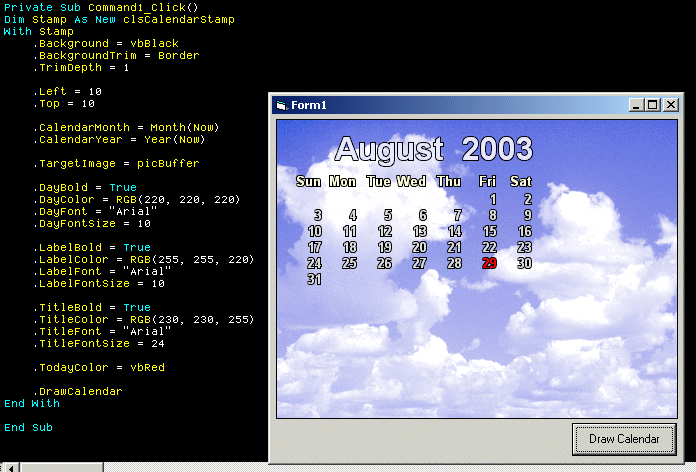



## Excellent potential: Class to draw a calendar month onto a bitmap

### Description

----

*** updated to correct day 1 positioning   ***

----

*** Updated to use dateserial as per comments ***

----

* I will convert this to a wallpaper stamper  *

* real soon                   *

----

Basically draw a formatted calendar month to a picturebox. All in a self contained class. Fancy having a batch app that when you start up your pc, it takes your wallpaper and sticks a calendar in the top right of your wallpaper! This is the class to base that on! I will write the whole thing, but in the meantime a fully functional class!
 
### More Info
 

             |
---                |---
**Submitted On**   |2003-09-03 03:18:02
**By**             |[Fosters](https://github.com/Planet-Source-Code/PSCIndex/blob/master/ByAuthor/fosters.md)
**Level**          |Intermediate
**User Rating**    |4.8 (38 globes from 8 users)
**Compatibility**  |VB 4\.0 \(32\-bit\), VB 5\.0, VB 6\.0
**Category**       |[Graphics](https://github.com/Planet-Source-Code/PSCIndex/blob/master/ByCategory/graphics__1-46.md)
**World**          |[Visual Basic](https://github.com/Planet-Source-Code/PSCIndex/blob/master/ByWorld/visual-basic.md)
**Archive File**   |[Excellent\_164019932003\.zip](https://github.com/Planet-Source-Code/fosters-excellent-potential-class-to-draw-a-calendar-month-onto-a-bitmap__1-48070/archive/master.zip)

